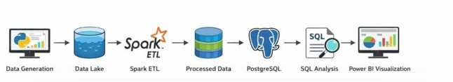
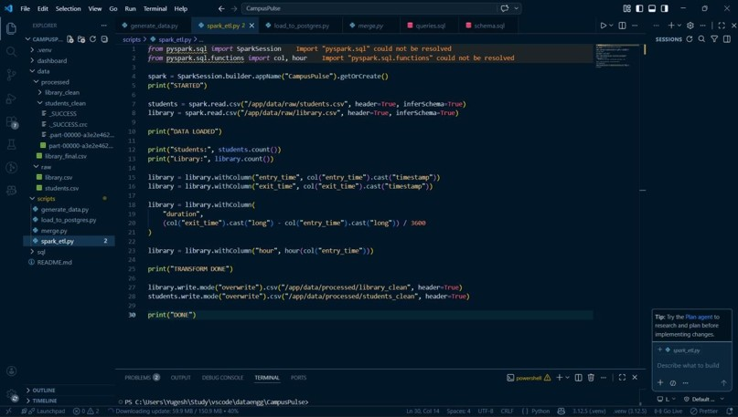
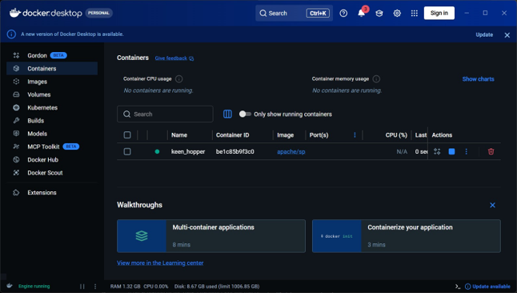
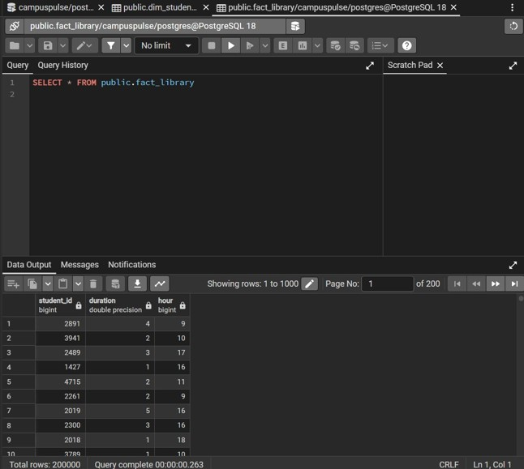
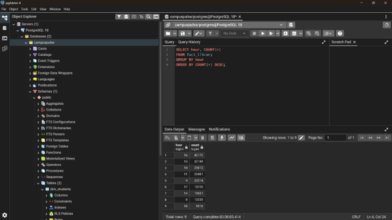
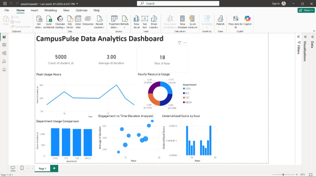

# 📊 CampusPulse Data Hub — End-to-End Data Engineering Pipeline for Campus Resource Analytics


---

# 📌 Overview

**CampusPulse Data Hub** is an end-to-end **Data Engineering** project that analyzes campus resource utilization through a scalable batch-processing pipeline.

The project simulates realistic student activity by generating synthetic datasets, processes them using **Apache Spark** running inside **Docker**, stores the transformed data in **PostgreSQL** using a **Star Schema**, performs analytical SQL queries, and visualizes insights through an interactive **Power BI Dashboard**.

The system demonstrates the complete lifecycle of a modern data engineering workflow—from raw data ingestion to business intelligence reporting.

This project is designed for:

- 🎓 Data Engineering academic projects
- 🏫 Campus resource utilization analysis
- 📊 Business Intelligence & Analytics
- 💻 Learning ETL pipelines using Apache Spark
- 📚 SQL & Data Warehousing practice

---

# ✨ Features

✔️ Synthetic Student Data Generation using Python

✔️ Batch ETL Pipeline using Apache Spark

✔️ Dockerized Spark Execution

✔️ Raw & Processed Data Layers

✔️ PostgreSQL Data Warehouse

✔️ Star Schema Design (Fact & Dimension Tables)

✔️ SQL-based Analytics

✔️ Interactive Power BI Dashboard

✔️ Peak Usage Analysis

✔️ Department-wise Resource Utilization

✔️ Underutilized Resource Identification

✔️ Average Engagement Duration Analysis

---

# 🛠️ Tech Stack

## Programming

- Python

## Data Engineering

- Apache Spark
- Docker

## Database

- PostgreSQL

## Data Processing

- Pandas
- Faker

## Analytics

- SQL

## Visualization

- Power BI

---

# 🧠 Project Workflow

```text
Synthetic Data Generation (Python)
                │
                ▼
       Raw CSV Data Lake
                │
                ▼
      Apache Spark ETL
      (Docker Container)
                │
                ▼
     Processed CSV Layer
                │
                ▼
      PostgreSQL Warehouse
      (Star Schema Design)
                │
                ▼
        SQL Analytics
                │
                ▼
      Power BI Dashboard
```

---
# 🏛️ Data Warehouse Design

The project follows a **Star Schema** for efficient analytical querying.

```
                 dim_students
                      │
                      │
                      ▼
               fact_library
```

**Dimension Table (`dim_students`)**

- Student ID
- Name
- Department
- Academic Year

**Fact Table (`fact_library`)**

- Student ID
- Duration
- Hour
---
# 🚀 Installation & Setup

## 1️⃣ Clone the Repository

```bash
git clone https://github.com/Yugeshkumar31/CampusPulse-DataHub.git

cd CampusPulse-DataHub
```

---

## 2️⃣ Create Virtual Environment

### Windows

```bash
python -m venv .venv

.venv\Scripts\activate
```

### Linux / macOS

```bash
python3 -m venv .venv

source .venv/bin/activate
```

---

## 3️⃣ Install Dependencies

```bash
pip install -r requirements.txt
```

---

## 4️⃣ Generate Synthetic Data

```bash
python scripts/generate_data.py
```

This generates

- students.csv
- library.csv

inside

```
data/raw/
```

---

## 5️⃣ Start Docker

Open Docker Desktop.

Run the Apache Spark container

```bash
docker run -it -v ${PWD}:/app apache/spark /bin/bash
```

Inside the container run

```bash
/opt/spark/bin/spark-submit /app/scripts/spark_etl.py
```

The processed datasets will be created inside

```
data/processed/
```

---

## 6️⃣ Load Data into PostgreSQL

Create the database

```sql
CREATE DATABASE campuspulse;
```

Run

```bash
python scripts/load_to_postgres.py
```

This loads

- dim_students
- fact_library

into PostgreSQL.

---

## 7️⃣ Execute SQL Analytics

Run the SQL queries available in

```
sql/queries.sql
```

to analyze

- Peak Usage Hours
- Department-wise Usage
- Average Duration
- Underutilized Time Slots

---

## 8️⃣ Open Power BI Dashboard

Open

```
dashboard/CampusPulseDashboard.pbix
```

Refresh the PostgreSQL connection.

Explore the dashboard interactively.

---

# 📷 Screenshots

### 🏗️ Project Architecture

<p align="center">

</p>

Illustrates the complete end-to-end data engineering pipeline from synthetic data generation to business intelligence visualization.

---

### ⚡ Apache Spark ETL Pipeline

<p align="center">

</p>

Apache Spark performs Extract, Transform, and Load (ETL) operations, including data cleaning, feature engineering, and preparation for analytical storage.

---

### 🐳 Dockerized Spark Environment

<p align="center">

</p>

Apache Spark is executed inside a Docker container, providing an isolated and reproducible environment for scalable data processing.

---

### 🗄️ PostgreSQL Dimension Table

<p align="center">

</p>

The **dim_students** table stores descriptive information about students, including department and academic year.

---

### 🗄️ PostgreSQL Fact Table

<p align="center">

</p>

The **fact_library** table stores analytical measures such as resource usage duration and hourly activity, forming the fact table of the Star Schema.

---

### 📊 SQL Analytics

<p align="center">

</p>

Analytical SQL queries are executed to identify peak usage hours, department-wise utilization, average engagement duration, and other business insights.

---

### 📈 Power BI Dashboard

<p align="center">

</p>

Interactive dashboard providing insights into campus resource utilization, department-wise activity, peak usage trends, engagement analysis, and underutilized time slots.
---

# 📂 Project Structure

```text
CampusPulse-DataHub/
│
├── dashboard/
│   └── CampusPulseDashboard.pbix
│
├── data/
│   ├── raw/
│   │   ├── students.csv
│   │   └── library.csv
│   │
│   └── processed/
│       ├── students_clean/
│       ├── library_clean/
│       └── library_final.csv
│
├── scripts/
│   ├── generate_data.py
│   ├── spark_etl.py
│   ├── merge.py
│   └── load_to_postgres.py
│
├── sql/
│   ├── schema.sql
│   └── queries.sql
│
├── screenshots/
│  ├── architecture.png
│  ├── spark_etl.png
│  ├── docker.png
│  ├── postgres_dimension.png
│  ├── postgres_facttable.png
│  ├── sql_queries.png
│  └── dashboard.png
│
├── README.md
├── requirements.txt
└── LICENSE
```

---

# 🧪 ETL Pipeline

### Extract

- Read raw CSV datasets
- Load student and library datasets

### Transform

- Handle missing values
- Convert timestamps
- Calculate resource usage duration
- Extract hourly features
- Remove inconsistent records

### Load

- Save cleaned data
- Load into PostgreSQL
- Build Star Schema for analytics

---

# 📊 SQL Analytics

The project performs analytical queries including:

- Peak Usage Hours
- Department-wise Resource Utilization
- Average Resource Usage Duration
- Underutilized Time Slots
- Usage Distribution Analysis

---

# 📈 Power BI Dashboard

The dashboard includes

- 📉 Peak Usage Trend (Line Chart)
- 📊 Department Usage Comparison (Column Chart)
- 🍩 Department Distribution (Donut Chart)
- 📍 Engagement Analysis (Scatter Plot)
- 📉 Underutilized Resource Analysis
- 📌 KPI Cards
  - Total Students
  - Average Duration
  - Maximum Active Hour

---

# 🏗️ Data Warehouse Design

The project follows a **Star Schema**.

### Dimension Table

```
dim_students
```

- student_id
- name
- department
- year

### Fact Table

```
fact_library
```

- student_id
- duration
- hour

---

# 🚀 Future Enhancements

- ⚡ Apache Kafka for Real-time Streaming
- ☁️ Cloud Deployment (AWS / Azure / GCP)
- ❄️ Snowflake Data Warehouse Integration
- 🧱 Databricks Lakehouse Implementation
- 📈 Predictive Analytics using Machine Learning
- 🌐 Streamlit Dashboard
- 📊 Advanced KPI Monitoring
- 🔔 Automated Alerts for Peak Resource Usage

---

# 🤝 Contributing

Contributions are welcome.

- Fork the repository

- Create a new branch

```text
feature-new
```

- Commit your changes

- Open a Pull Request

---

# 📜 License

This project is licensed under the **MIT License**.

See the **LICENSE** file for details.

---

# 👨‍💻 Author

**G Yugesh Kumar**

📧 Email: **gyugeshkumar2005@gmail.com**

🌐 LinkedIn: **https://www.linkedin.com/in/gyugeshkumar**

🐙 GitHub: **https://github.com/Yugeshkumar31**
